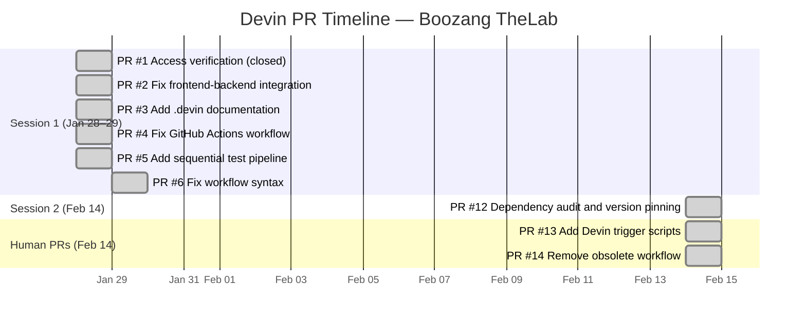
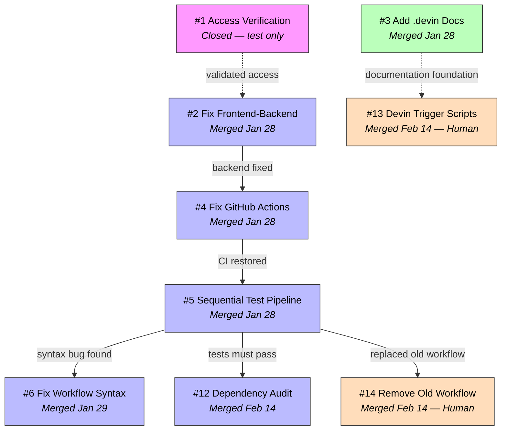
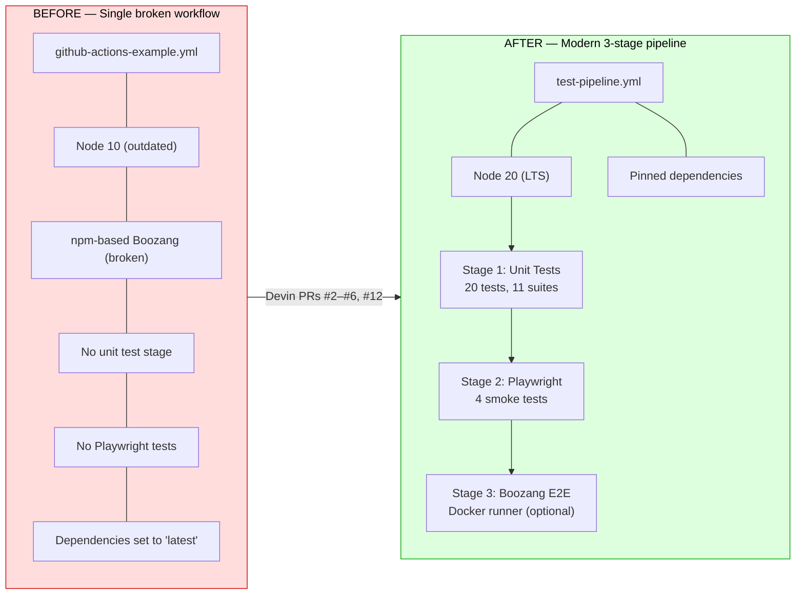

# Devin Case Study: CI/CD Pipeline Transformation

> How an AI agent transformed a broken CI pipeline into a modern, multi-stage test automation system in two working sessions.

---

## PR Sequence Timeline

## PR Dependency Graph

### Legend

| Color | Meaning |
|-------|---------|
| Blue | Devin PR — merged |
| Pink | Devin PR — closed (test only) |
| Green | Devin PR — documentation |
| Orange | Human PR |

---

## PR Summary Table

| PR | Title | Author | Date | Status | Key Changes |
|----|-------|--------|------|--------|-------------|
| #1 | Access verification | Devin | Jan 28 | Closed | Dummy PR to validate repo access |
| #2 | Fix frontend-backend integration | Devin | Jan 28 | Merged | Proxy config, relative API paths, `getApiUrl()` helper |
| #3 | Add .devin documentation | Devin | Jan 28 | Merged | Journal, guidelines, commands, hooks |
| #4 | Fix GitHub Actions workflow | Devin | Jan 28 | Merged | Node 20, Docker runner, updated Boozang config |
| #5 | Sequential test pipeline | Devin | Jan 28 | Merged | 3-stage pipeline, Playwright tests, fixed 20 unit tests |
| #6 | Fix workflow syntax | Devin | Jan 29 | Merged | Replaced invalid `secrets` in `if` with env var pattern |
| #12 | Dependency audit | Devin | Feb 14 | Merged | Pinned all `"latest"` tags to specific versions |
| #13 | Devin trigger scripts | Human | Feb 14 | Merged | API trigger + PR polling scripts |
| #14 | Remove obsolete workflow | Human | Feb 14 | Merged | Deleted `github-actions-example.yml` |

---

## Before / After: CI Pipeline

### Detailed Comparison

| Aspect | Before | After |
|--------|--------|-------|
| **Workflow file** | `github-actions-example.yml` | `test-pipeline.yml` |
| **Node.js version** | 10.x (EOL) | 20.x (LTS) |
| **GitHub Actions versions** | checkout@v2, setup-node@v1 | checkout@v4, setup-node@v4 |
| **Test runner** | npm `boozang` package (broken) | Docker `styrman/boozang-runner` |
| **Unit tests** | Not in pipeline, imports broken | 20 tests passing, 11 suites |
| **E2E tests** | None | 4 Playwright smoke tests |
| **Pipeline stages** | Single monolithic job | 3 sequential stages with gates |
| **Secret handling** | N/A | Env var pattern for optional Boozang |
| **Dependencies** | `"latest"` tags (10 packages) | All pinned to `^x.y.z` |
| **Frontend-backend** | Hardcoded `localhost:9000` URLs | Proxy config + `getApiUrl()` helper |
| **Report publishing** | Broken | Cucumber HTML reports to GitHub Pages |

### Key Outcomes

- **7 Devin PRs** created across 2 sessions (6 merged, 1 closed as test-only)
- **0 broken merges** to main
- **Pipeline went from non-functional to 3-stage sequential** with unit, integration, and E2E tests
- **Self-correction demonstrated**: PR #6 fixed a syntax issue Devin introduced in PR #5
- **Total files changed**: ~35 files across functional PRs

---

*Generated from PR data in [ljunggren/boozang-thelab](https://github.com/ljunggren/boozang-thelab). Part of the [multi-agent workflow experiment](.devin/multi-agent-workflow.md).*
